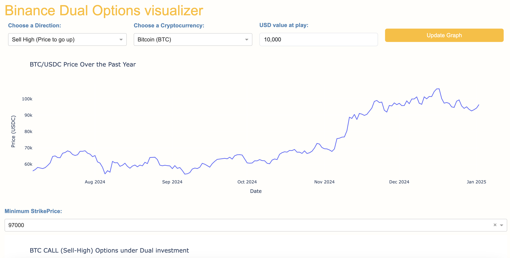
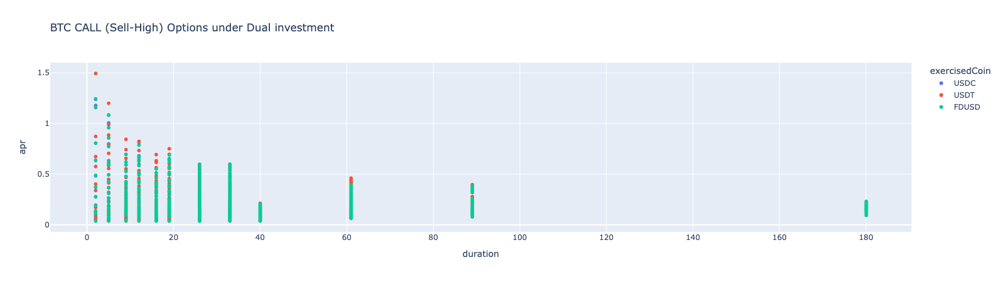
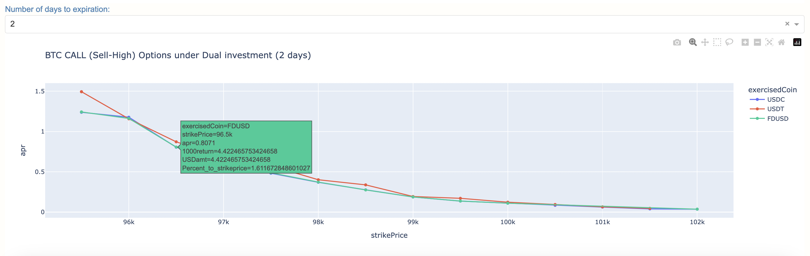

# AlgoRaid

#### Repository guide
Will quickly guide through the repository folders

##### Experiments
Experiments folder contains 2 experiments primarily
- Stablecoin Arbitrage analysis
- Binance Cash secured puts and Covered call analysis
    - Charts about the yield at different strike price

##### WebApp
Python flask Dash Plotly Webapp to visualise Binance options under the Dual Investment category. Dual investment products effectively provide cash secured puts and Covered calls with easier UI. With this tool we could expedite our analysis of the risk taken and the potential returns. Binance dualinvestment products are european options and all data is directly from Binance API

Screenshots of Webapp

Choosing Direction of options movement, Asset interested and approx volume in USD we would like to visualise

The first chart shows the different exercise timelines and the APRs of the different options. Binance offers differing Yield Options of the same Dual investment product under for the the different Stablecoins that they support. This difference exists primarily cause of different demand supply volumes interacting with the options. Assuming all USD stablecoins are roughly the same, we can opt to go for the higher yield generating Option product. 

The next chart shows how the APR yield changes as the strikeprice goes further away from the current price. Through this visualisation we can choose the Options product that caters to our personal risk appetite

For knowledge purposes and not financial advice on what to do and what not to do. Please take it as an experimental knowledge based tool. 
