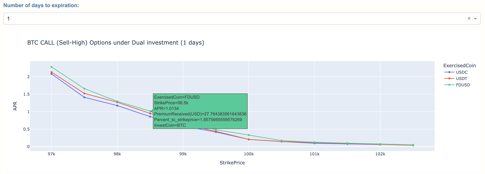

# AlgoRaid

Hosted link: [bnoptionsvizualize](https://bnoptionsvizualize.onrender.com/)

[Dislclaimer: Webapp is for experimentations, simulations and knowledge purposes only. Not financial advice of any kind]

#### Repository guide 
Repository contains mainly 2 components (Experiments and Webapp).

##### Experiments
Experiments folder contains 2 experiments primarily
- Stablecoin Arbitrage analysis
- Binance Cash secured puts and Covered call analysis
    - Charts about the yield at different strike price

##### DualInvestment Options visualisation WebApp

Python flask Dash Plotly Webapp to visualise Binance options under the Dual Investment category. Dual investment products effectively provide cash secured puts and Covered calls with easier UI. With this tool we could expedite our analysis of the risk taken and the potential returns. Binance dualinvestment products are european options and all data is directly from Binance API

User flow of webapp:

**Step1:** Choose a direction you would like to go
1. Covered Call / Sell High - You have the underlying (crypto) Asset and would like to sell that at higher price. 
2. Cash Secured Put / Buy Low - You have the Stablecoins such as USDC, USDT and would like to buy the Crypta asset at a lower price. 

Both options pay you a Options premimum for opting for it.
More info at: https://www.binance.com/en/dual-investment

**Step2:** Select the crypto asset that you are interested in Buying more of or selling off. 

**Step3:** Enter in the amount in USD that you you like to put in for this options strategy. 

**Step4:** Click update Graph button to see the charts update.

**Components of the Webapp:**

The First chart is the daily price chart for the past 6 months. Gives a rough feel of the price movements. *Screenshot above^*

The Second chart shows the different Options expiration timelines and the APRs. Upon hover you would be able to see more information such as how much premimum can we approximately gain from the specific option

The Third chart shows how the APR yield changes as the strikeprice goes further away from the current price for a specific duration. Through this visualisation we can choose the Options product that caters to our personal risk appetite. Like the above upon hover we get more information about how much premium we can collect from the option

